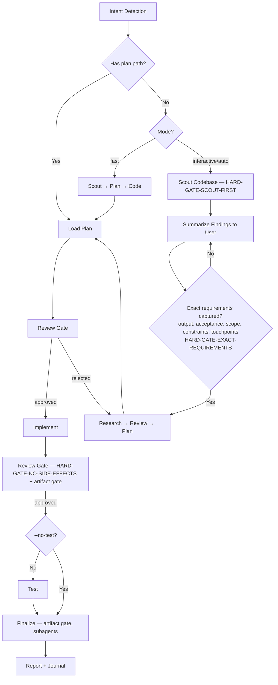

# TheOneKit Cook -- Feature Implementation

End-to-end feature implementation. Routes to the registered implementer agent for the current kit. Plan before code; harness over hope.

> **Kit-wide discipline:** features and changes that touch kit-owned content (anything under `.claude/`) ship via the owning kit source repo per [`rules/kit-wide-fix-discipline.md`](../../rules/kit-wide-fix-discipline.md). Local-only edits regress on next `t1k modules update` — implement in the kit, release picks it up.

**Principles:** YAGNI, KISS, DRY | Token efficiency | Concise reports

## Pre-flight Step 0 — Fuzzy plan/path arg resolution (MANDATORY)

If the user's arg is not an exact existing path (e.g. `chaosforge-demo`, `plans/chaosforge-demo`, `phase-3`, empty / "active plan"), run the Fuzzy Plan / Path Resolution Protocol at `references/fuzzy-plan-resolution.md` BEFORE intent detection or bail.

The skill MUST NOT emit "no plan matching" / "exact path required" until the protocol has been applied and its Step 6 reached. The protocol uses only `Bash` + `Glob`, which are always available.

## Tool guard — `AskUserQuestion` is deferred

`AskUserQuestion` is a deferred tool: its name appears in the deferred-tools system-reminder but its schema is NOT loaded at session start. Direct invocation fails with `InputValidationError`.

**Operational pre-step (mandatory before drafting any structured multi-option question):**

1. Verify `AskUserQuestion` is in the loaded tool list. If not, run:
   ```
   ToolSearch(query="select:AskUserQuestion", max_results=1)
   ```
2. THEN draft and invoke the tool with batched options.

**Failure mode this guard prevents:** assistant remembers the rule, drafts the question correctly in its head, then because the tool isn't loaded, falls back to "I'll just write the options as prose, and call the tool next time." Drafting prose bullets first is a violation — see `rules/always-ask-on-unresolved.md` "Forbidden prose" table.

## Decision tree — which path do I take?

Pick by intent; keep loading minimal.

| Intent | Path |
|---|---|
| Ship a feature end-to-end with research + tests + review | Default `--interactive` workflow below |
| Plan exists already; execute it | Pass plan path; mode auto-detects to `code` |
| Skip research; you trust the spec | `--fast` (still requires plan step) |
| Multiple unrelated features at once | `--parallel` (sub-agents on disjoint files) |
| Test-driven: tests first, then code | `--tdd` (incompatible with `--parallel` / `--no-test`) |

## Usage
```
/t1k:cook <natural language task OR plan path>
```

**IMPORTANT:** If no flag is provided, the skill uses `interactive` mode by default.

**Optional flags:** `--interactive` (default) | `--fast` (skip research) | `--parallel` (multi-agent) | `--no-test` | `--auto` (auto-approve LOW-RISK steps only) | `--tdd` (test-driven: write tests first, implement, verify)

**Auto mode contract:** `--auto` is NOT "AI does whatever it wants." `--auto` runs when there is enough evidence (5 artifacts validated by the artifact-gate hook) AND risk is in the allowed zone (`risk-gate.json` `highRisk: false`). High-risk changes always stop for human approval before finalize/commit/ship, even in auto mode. Full rules: `references/artifact-gate-rules.md`.

## Agent Routing
Follow protocol: `skills/t1k-cook/references/routing-protocol.md` — role: `implementer`

## Skill Activation
Follow protocol: `skills/t1k-cook/references/activation-protocol.md`

HARD-GATE contract: see `rules/workflow-gates.md` (auto-loaded).

<HARD-GATE>
Do NOT write implementation code until a plan exists and has been reviewed.
This applies regardless of task simplicity. "Simple" tasks are where unexamined assumptions waste the most time.
Exception: `--fast` mode skips research but still requires a plan step.
User override: If user explicitly says "just code it" or "skip planning", respect their instruction.
</HARD-GATE>

<HARD-GATE-SCOUT-FIRST>
Before planning OR asking clarifying questions, scan the codebase. Mandatory scout outputs:

1. Project type, language(s), framework(s) — from `package.json` / `pyproject.toml` / `go.mod` / `*.csproj` / `Cargo.toml` / Unity `manifest.json` / Cocos `package.json` / etc.
2. Existing modules/files relevant to the task
3. Current patterns/conventions for similar features (so the implementation matches them)
4. Existing docs in `./docs/` and any in-flight plans in `./plans/` covering this area
5. Public APIs, schemas, contracts that the task could affect

State a 3-6 bullet codebase-context summary to the user BEFORE asking questions. Skip ONLY when input is a `plan.md` / `phase-*.md` path (the plan already encodes scout output).
</HARD-GATE-SCOUT-FIRST>

<HARD-GATE-EXACT-REQUIREMENTS>
Before producing a plan, you MUST be able to answer ALL five in one concrete sentence each (use `AskUserQuestion` to pin them down — do NOT proceed on vague intent):

1. **Expected output** — the concrete artifact(s) the user will see at the end (file paths, feature behavior, UI screen, API endpoint + payload, CLI command + flags).
2. **Acceptance criteria** — specific behaviors / inputs → outputs / edge cases that MUST work to call it "done".
3. **Scope boundary** — what is explicitly OUT of scope this round.
4. **Non-negotiable constraints** — stack, file locations, naming, backward compatibility, deadlines, performance budgets.
5. **Touchpoints** — which existing files/modules (from scout) will be modified or extended; which contracts must stay stable.

Ground every `AskUserQuestion` option in scout findings (e.g., "Add to `src/api/users.ts` (matches existing pattern) or new `src/api/profile.ts`?"). Skip ONLY when input is a `plan.md` / `phase-*.md` path (the plan already encodes these).
</HARD-GATE-EXACT-REQUIREMENTS>

<HARD-GATE-NO-SIDE-EFFECTS>
Implementation is NOT done until verified to be side-effect-free. Code-review and test gates MUST prove ALL five:

1. New behavior matches every acceptance criterion above.
2. All tests pass — including tests in modules that share files/contracts with the change.
3. No existing business logic / workflow regression: explicitly walk each touchpoint and any caller of changed functions.
4. No new lint / type / build errors anywhere in the repo.
5. Public contracts unchanged unless intentional and called out (function signatures, exported types, API responses, DB schemas, env vars, config keys).

User override: If user invoked `--no-test`, item 2 is downgraded to a warning. Surface the unverified-tests risk in the finalize `AskUserQuestion` so the user accepts the trade-off rather than having it silently chosen. Items 1, 3, 4, 5 remain enforceable via the mandatory `t1k-code-reviewer` subagent.

If review/testing reveals a side effect, regression, or broken workflow, STOP. Use `AskUserQuestion` to present:
- What broke (file, test, workflow, user-facing behavior)
- Why this implementation caused it (1-line cause)
- 2-4 concrete options, e.g.:
  - "Revert this slice and re-plan with stricter scope"
  - "Keep the implementation and update `<dependents>` to match the new contract"
  - "Add a compatibility shim at `<boundary>` so old callers keep working"
  - "Accept the regression — old behavior was unintended/buggy"

Let the user decide. Do not silently patch around regressions.
</HARD-GATE-NO-SIDE-EFFECTS>

Anti-rationalization discipline: see `rules/agent-anti-rationalization.md` (auto-loaded).

## Process Flow (Authoritative)



**This diagram is authoritative.** If prose in this skill or its references conflicts with this flow, follow the diagram.

## Smart Intent Detection

| Input Pattern | Detected Mode |
|---------------|---------------|
| Path to `plan.md` or `phase-*.md` | code — execute existing plan |
| Contains "fast", "quick" | fast — skip research |
| Contains "trust me", "auto" | auto — auto-approve low-risk artifact-validated steps; stop on high-risk |
| Lists 3+ features OR "parallel" | parallel — multi-agent |
| Contains "no test", "skip test" | no-test — skip testing |
| Contains "tdd", "test first", "test-driven" | tdd — write tests before implementation |
| Default | interactive — full workflow |

Full detection logic: `references/intent-detection.md`

## Workflow

```
[Intent Detection] -> [Drift Check] -> [Scout HARD-GATE] -> [Requirements HARD-GATE] -> [Research?] -> [Review] -> [Plan] -> [Review] -> [Implement] -> [Review + Artifact Gate] -> [Test?] -> [Review] -> [Finalize + Artifact Gate]
```

**Drift Check (Step 0.5, MANDATORY):** before any research/plan/code, run a quick `git fetch` + scan of recent merges (default branch, last ~24h) to confirm a teammate hasn't already shipped this fix or partially addressed it. Applies in ANY repo where cook runs — kit source, consumer game project, library, anywhere. Skips silently for non-git or no-remote directories. Procedure + decision tree: `references/workflow-steps.md` § "Step 0.5".

**Issue Claim (when routing a fix/issue-driven workflow):** cook defers to the same Step 0.5 claim gate defined in `t1k:fix` — enforced via the shared `.claude/scripts/t1k-issue-claim.cjs` and `rules/issue-claim-discipline.md`. No separate gate logic here.

| Mode | Research | Testing | Review Gates |
|------|----------|---------|--------------|
| interactive | yes | yes | User approval at each step |
| auto | yes | yes | Auto only if all 5 artifacts PASS AND `risk-gate.json` `highRisk: false`. Score alone NEVER auto-approves. |
| fast | no | yes | User approval at each step |
| parallel | optional | yes | User approval at each step |
| no-test | yes | no | User approval at each step |
| code | no | yes | User approval per plan |
| tdd | yes | yes (3.T/3.I/3.V) | User approval at each step |

Full step definitions: `references/workflow-steps.md`
TDD sub-step details: `references/workflow-steps.md` → `## --tdd Flag Behavior`
Review processes: `references/review-cycle.md`

### Guards

- `--tdd + --parallel`: REFUSE with error: "TDD requires strict ordering (tests → implement → verify); parallel execution cannot preserve this. Use `--tdd` alone, or `--parallel` without `--tdd`. For a fast sequential path, consider `--tdd --fast`."
- `--tdd + --no-test`: REFUSE with error: "TDD mode inherently requires the test suite; `--no-test` is contradictory. Remove one of the flags."
- `--tdd + --parallel` is unsupported and will error. Do not attempt to combine them.
- `--auto + --interactive`: existing guard, unchanged.

## Artifact Gate (harness for the review + finalize stages)

After implementing, write the 5 required artifacts and validate via the workflow-artifact-gate hook. **Full rules, schemas, kill switch, and engine-kit extension contract: `references/artifact-gate-rules.md`.** SSOT shared with `t1k:fix`.

## Required Subagents — CRITICAL ENFORCEMENT

Testing, Review, and Finalize phases **MUST** use the Task tool to spawn:

| Phase | Subagent | Why (separation of cognitive powers) |
|---|---|---|
| Research (optional) | `t1k-researcher` | External-context gathering without polluting main session |
| Plan | `t1k-planner` | Plan discipline; not the implementer |
| Implement | `implementer` (resolved per-kit via routing JSON) | Engine-specific (Unity DOTS, Cocos, RN, web, etc.) |
| UI work | `ui-ux-designer` (when applicable, kit-resolved) | UX-first lens |
| Test | `t1k-tester`, `t1k-debugger` | Independent verification |
| Review | `t1k-code-reviewer` | Independent review with explicit checks: every acceptance criterion met; no regression in touchpoints/blast-radius; no breaking changes to public contracts; follows scout patterns; no new lint/type/build errors |
| Finalize | `t1k-project-manager` + `t1k-docs-manager` + `t1k-git-manager` | Plan sync-back, docs update, conventional commits |

**If workflow ends with 0 Task tool calls, it is INCOMPLETE.** Do not inline testing, review, or finalization yourself — the value of multi-agent is the **cognitive separation of powers** (the implementer is not the reviewer; the planner is not the coder). Same context = same blind spots. Multi-agent that share one context, with no acceptance criteria, with no artifacts, is just many-people-being-wrong-together.

Full subagent table and injection protocol: `references/subagent-patterns.md`

**Finalize (never skip):** t1k-project-manager → plan sync-back | t1k-docs-manager → update `./docs` | t1k-git-manager → commit offer

- When you discover a non-obvious gotcha while implementing, emit a
  `[t1k:lesson kit="..." skill="..." fragment="..." reason="..."]` marker
  in your final message. The lesson-collector hook queues it for
  follow-up sync-back automatically.

## Blocking Gates (Non-Auto Mode)

Human review required at: Post-Research, Post-Plan, Post-Implementation, Post-Testing (100% pass required).

Always enforced (every mode): 100% test pass (unless `--no-test`), artifact-gate validation, code-reviewer subagent invocation. Score is advisory; only artifact validation approves.

## When implementation goes wrong — recovery via rollback

If an implementation corrupts `~/.claude/` state (bad merge, mis-applied
prefix, broken hooks), use the H7 rollback command rather than a manual
clean-up:

```
t1k rollback --kit <name> --to-snapshot pre-<previous-version>
```

- Snapshots live at `~/.claude/.t1k-snapshots/<kit>/pre-<version>/`.
  Cap is 5 most-recent per kit; older ones soft-move to
  `~/.claude/.t1k-trash/<kit>/`.
- `--to-snapshot` MUST literally start with `pre-` (e.g. `pre-2.4.1`).
  Bare versions are rejected.
- `--yes` is currently a no-op as of cli@v4.14.0 — does not bypass
  anything. Future-proof only.
- Restore is a non-destructive copy: files added by the bad implementation
  are NOT removed. Run `/t1k:doctor` afterwards to spot stragglers.

**Critical caveat (cli@v4.14.0):** the install/update pipeline does not
yet auto-create snapshots. If `t1k rollback` reports
`snapshot '<kit>/pre-<version>' does not exist`, fall back to
`t1k install --reset` (the sanctioned destructive path; takes its own
`~/.claude-backup-{ISO-ts}/` first). NEVER `rm -rf ~/.claude/` — <!-- gate:allow-rm-claude (rule statement) -->
the `validate-no-raw-rm-claude.cjs` gate forbids it and you'll lose
`.t1k-snapshots/`, `.t1k-trash/`, and any user-customized files.

For per-file/per-step recovery, prefer `git restore` on the project
side; the H7 rollback is for `~/.claude/` state, not project source.
Full reference: `skills/t1k-kit/references/cli-commands.md` →
`t1k rollback`.

## Environment Variables

T1K resolves env vars in priority order — never hardcode values. Details: `references/env-hierarchy.md`

Artifact-gate-specific:
- `T1K_WORKFLOW_ARTIFACT_DIR` — pin the active artifact dir (overrides pointer file)
- `T1K_WORKFLOW_ARTIFACT_GATE_DISABLED=1` — kill switch (use only when debugging the hook itself)

## References

- `references/intent-detection.md` — detection rules and routing logic
- `references/workflow-steps.md` — detailed step definitions for all modes
- `references/review-cycle.md` — interactive and auto review processes
- `references/subagent-patterns.md` — subagent invocation patterns
- `references/env-hierarchy.md` — .env resolution hierarchy
- `references/god-prefab-extraction-risk.md` — plan-phase detection for god-prefab moves to Addressables; required audit during Step 2 when removing prefabs from scenes
- `references/runtime-smoke-gate.md` — Step 3 HARD-GATE: runtime Play Mode smoke required when scene/prefab assets are touched; prevents the The1Studio/theonekit-core#176 NRE-cascade incident class
- `.claude/schemas/workflow-artifact-*.schema.json` — 5 artifact schemas validated by the gate

## Contribution Scoring

If Finalize opens a PR, invoke `t1k:contribution-score` with `type=sync-back-pr` + PR URL/title/body. Fire-and-forget; SSOT gates non-T1K repos. See `.claude/skills/t1k-contribution-score/SKILL.md`.

## Sub-Agent Fork Hygiene

**Sub-agent forking:** see `skills/t1k-architecture/references/fork-hygiene.md`.
