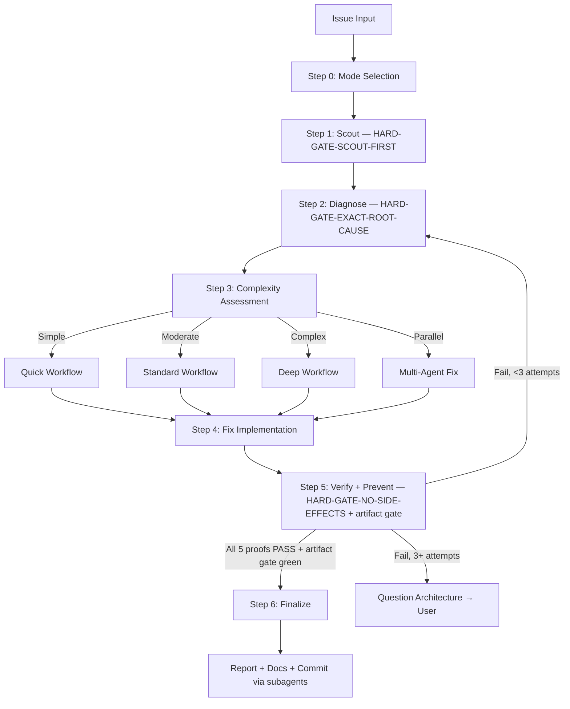

# TheOneKit Fix — Bug Fixing

Fix issues with intelligent classification and registry-based routing. Investigate before patching; harness over hope.

> **Kit-wide discipline:** every fix to kit-owned content (anything under `.claude/`) lands in the owning kit source repo per [`rules/kit-wide-fix-discipline.md`](../../rules/kit-wide-fix-discipline.md). Local-only patches regress for every other consumer on next `t1k modules update`.

## Pre-flight Step 0 — Fuzzy plan/path arg resolution (MANDATORY)

If the user provides a fuzzy plan/path/phase arg (e.g. `chaosforge-demo`, `plans/chaosforge-demo`, `phase-3`), an empty arg, or natural-language ref like "active plan" / "current plan" / "this plan", run the Fuzzy Plan / Path Resolution Protocol at `skills/t1k-cook/references/fuzzy-plan-resolution.md` BEFORE bail. Skill MUST NOT emit "no path matching" / "exact path required" until that protocol has been applied and Step 6 reached.

## Tool guard — `AskUserQuestion` is deferred

`AskUserQuestion` is a deferred tool: its name appears in the deferred-tools system-reminder but its schema is NOT loaded at session start. Direct invocation fails with `InputValidationError`.

**Operational pre-step (mandatory before drafting any structured multi-option question):**

1. Verify `AskUserQuestion` is in the loaded tool list. If not, run:
   ```
   ToolSearch(query="select:AskUserQuestion", max_results=1)
   ```
2. THEN draft and invoke the tool with batched options.

**Failure mode this guard prevents:** assistant remembers the rule, drafts the question correctly in its head, then because the tool isn't loaded, falls back to "I'll just write the options as prose, and call the tool next time." Drafting prose bullets first is a violation — see `rules/always-ask-on-unresolved.md` "Forbidden prose" table.

## Step 0.5 — Issue Claim Gate (fires ONLY when a target GitHub issue is supplied)

Before running Scout or Diagnose, check and acquire a claim on the issue via the SSOT script — never run `gh issue edit` or `gh pr create` for claiming yourself.

```bash
node .claude/scripts/t1k-issue-claim.cjs check <owner/repo#N>
```

Read the emitted JSON `state` field:

| state | Action |
|---|---|
| `"held"` (foreign holder) | **HARD BLOCK.** Surface `holder` + `prNumber`. Instruct user to re-run with `--steal` if they want to override. Do NOT proceed to Scout/Diagnose. |
| `"free"` OR `--steal` flag given | Run `acquire`: `node .claude/scripts/t1k-issue-claim.cjs acquire <owner/repo#N>`. Use the returned `markerLine`, `bodyTrailer` (`Fixes #N`), and `labelToApply` when opening the WIP draft PR — the draft PR IS the durable claim. |
| `"skip"` | Out-of-scope repo or no config. Proceed normally without claiming. |
| `"stale"` | A foreign draft PR is stale (inactive > config threshold). Proceed as `free`; the stale holder is reported only, not a blocker. |

**After opening the WIP draft PR — tie-break re-check (mandatory):** the moment the draft PR exists, run the deterministic tie-break so a sub-second double-acquire can't leave two open PRs on the issue:

```bash
node .claude/scripts/t1k-issue-claim.cjs acquire <owner/repo#N> --pr <newPrNumber>
```

If a lower-numbered claim PR by another contributor exists, the script auto-closes **your** PR and emits `{state:"held", yielded:true}` — stop and yield. Otherwise it confirms `{acquired:true}` and you proceed. (Mirrors `t1k-sync-back`'s post-PR step; Mitigation 1 of the no-CAS residual risk in `rules/issue-claim-discipline.md`.)

**Finalize step:** when the fix PR is ready for review, call `release` to convert the draft to ready-for-review:

```bash
node .claude/scripts/t1k-issue-claim.cjs release <owner/repo#N>
```

The `release` call marks the linked draft PR ready (draft → ready hands off to `t1k-babysit-pr`). Merge or close auto-releases the claim via GitHub state — no manual cleanup needed.

> This gate delegates all claim logic to `.claude/scripts/t1k-issue-claim.cjs`. Do NOT run `gh issue edit` or `gh pr create` for the claim itself. See `rules/issue-claim-discipline.md` for the full enforcement rule.

## Decision tree — which path do I take?

Pick by intent; keep loading minimal.

| Intent | Path |
|---|---|
| Diagnose and fix one bug end-to-end | Default `--auto` (Steps 1–6 below) |
| Trivial issue (lint, single type error) | `--quick` (skips deep diagnose) |
| Want human checkpoint before applying fix | `--review` |
| Multiple unrelated bugs at once | `--parallel` (sub-agents per issue) |
| 3+ fix attempts already failed | STOP — escalate to architecture discussion (HARD-GATE below) |

## Arguments

| Flag | Description |
|------|-------------|
| `--auto` | Autonomous mode (**default**). High-risk fixes stop for human approval before finalize/commit/ship (per artifact-gate). |
| `--review` | Human-in-the-loop review mode |
| `--quick` | Quick mode for trivial issues |
| `--parallel` | Route to parallel `implementer` agents per issue |

**Auto mode contract:** `--auto` is NOT "AI does whatever it wants." `--auto` runs when there is enough evidence (5 artifacts validated by the artifact-gate hook) AND risk is in the allowed zone (`risk-gate.json` `highRisk: false`). High-risk changes always stop for human approval, even in auto mode. Full rules: `skills/t1k-cook/references/artifact-gate-rules.md`.

HARD-GATE contract: see `rules/workflow-gates.md` (auto-loaded).

<HARD-GATE>
Do NOT propose or implement fixes before completing Steps 1-2 (Scout + Diagnose).
Symptom fixes are failure. Find the cause first through structured analysis, NEVER guessing.
If 3+ fix attempts fail, STOP and question the architecture — discuss with user before attempting more.
User override: `--quick` mode allows fast scout-diagnose-fix cycle for trivial issues (lint, type errors).
</HARD-GATE>

<HARD-GATE-SCOUT-FIRST>
Always scan the codebase BEFORE asking clarifying questions or forming hypotheses. Mandatory scout outputs (collect before Step 2):

1. Project type, language(s), framework(s) — from `package.json` / `pyproject.toml` / `go.mod` / `*.csproj` / `Cargo.toml` / Unity `manifest.json` / Cocos `package.json` / etc.
2. The exact file(s) where the symptom surfaces + their direct callers/dependents
3. Related tests covering the affected area
4. Recent commits (`git log --oneline -20`) touching scouted files — possible introducer
5. Existing patterns/conventions for this kind of code (so the fix matches them)

State a 3-6 bullet codebase-context summary to the user BEFORE asking questions. This kills the "imagined context" failure mode where the model hallucinates architecture from a few file reads instead of grounding hypotheses in real codebase evidence.
</HARD-GATE-SCOUT-FIRST>

<HARD-GATE-EXACT-ROOT-CAUSE>
Do NOT propose a fix until you can answer ALL six in one concrete sentence each:

1. **Exact symptom** — precise error message / failing assertion / observed behavior (copy verbatim, NOT paraphrased).
2. **Reproduction steps** — minimal sequence that triggers it (commands, inputs, environment).
3. **Expected vs actual** — what SHOULD happen vs what DOES happen.
4. **Root cause** (NOT symptom) — the underlying defect: specific line, missing check, race condition, contract violation, design flaw. Cite `file:line` evidence.
5. **Why now** — what change/condition exposed it today: recent commit (point to SHA), data shape change, env divergence, dep upgrade, half-finished migration. If you cannot answer "why now", you do not yet understand the system — return to scout.
6. **Blast radius** — every code path that depends on the broken behavior or shares the same root cause.

If ANY item is vague ("probably", "I think", "something with…"), use `AskUserQuestion` to gather missing facts (logs, repro, env) OR run more scout/debug — NEVER guess. Ground every `AskUserQuestion` option in scout findings (specific files, specific commits, specific functions) — never abstract.
</HARD-GATE-EXACT-ROOT-CAUSE>

<HARD-GATE-NO-SIDE-EFFECTS>
The fix is NOT done until verified to be side-effect-free. Step 5 MUST prove ALL five:

1. Original symptom no longer reproduces (re-run exact pre-fix repro from #2 above).
2. All tests in modified files + transitively-affected modules pass.
3. No business logic / workflow regression in the blast radius identified above (run those tests too, or manually walk the affected flows).
4. No new lint / type / build errors introduced anywhere.
5. Public API contracts (function signatures, exported types, response shapes, DB schemas, env vars) unchanged — OR the change is intentional and called out in the commit message.

If verification reveals a side effect, regression, or broken workflow, STOP. Do NOT silently patch around it. Use `AskUserQuestion` to present:
- What broke (file, test, workflow)
- Why the fix caused it (1-line cause)
- 2-4 concrete options, e.g.:
  - "Revert the fix and try a different root-cause angle"
  - "Keep the fix and update dependent code at `<files>` to match the new contract"
  - "Narrow the fix scope to `<subset>` so the regression goes away"
  - "Accept the regression — it was buggy behavior the test was locking in"

Let the user decide. Do not assume.
</HARD-GATE-NO-SIDE-EFFECTS>

Anti-rationalization discipline: see `rules/agent-anti-rationalization.md` (auto-loaded).

## Process Flow (Authoritative)



**This diagram is authoritative.** If prose in this skill or its references conflicts with this flow, follow the diagram.

## Agent Routing

Follow protocol: `skills/t1k-cook/references/routing-protocol.md`
This command uses roles: `implementer`, `t1k-debugger`

## Skill Activation

Follow protocol: `skills/t1k-cook/references/activation-protocol.md`

## Workflow Steps

| Step | Name | Key Action | Reference |
|------|------|------------|-----------|
| 0 | Mode Selection | Ask user for workflow mode if no `--auto` | `references/mode-selection.md` |
| 1 | Scout | Map per HARD-GATE-SCOUT-FIRST; emit 3-6 bullet summary | `references/workflow-quick.md` |
| 2 | Diagnose | Answer 6 slots per HARD-GATE-EXACT-ROOT-CAUSE | `references/diagnosis-protocol.md` |
| 3 | Complexity | Classify: Simple/Moderate/Complex/Parallel | `references/complexity-assessment.md` |
| 4 | Fix | Implement per selected workflow; minimal changes only | `references/workflow-standard.md` |
| 5 | Verify + Prevent | Run 5 proofs per HARD-GATE-NO-SIDE-EFFECTS + artifact gate | `references/prevention-gate.md` |
| 6 | Finalize | Report, t1k-docs-manager, commit offer | — |

Detailed workflow diagrams: `references/fix-workflow-overview.md`

## Step 5 — Artifact Gate (harness)

After verifying the fix, write the 5 required artifacts and validate via the workflow-artifact-gate hook. **Full rules, schemas, kill switch, and engine-kit extension contract: `skills/t1k-cook/references/artifact-gate-rules.md`.** SSOT shared with `t1k:cook`.

## Complexity Routing

| Level | Indicators | Workflow |
|-------|------------|----------|
| **Simple** | Single file, clear error, type/lint | `references/workflow-quick.md` |
| **Moderate** | Multi-file, root cause unclear | `references/workflow-standard.md` |
| **Complex** | System-wide, architecture impact | `references/workflow-deep.md` |
| **Parallel** | 2+ independent issues OR `--parallel` | Parallel `implementer` agents |

Specialized: `references/workflow-ci.md`, `references/workflow-logs.md`, `references/workflow-test.md`, `references/workflow-types.md`, `references/workflow-ui.md`

## Always-Activate Skills

- `/t1k:scout` (Step 1) — understand before diagnosing
- `/t1k:debug` (Step 2) — systematic root cause investigation
- `/t1k:think` (Step 2) — structured hypothesis formation
- `/t1k:problem-solve` (Step 2, conditional) — auto-activate when 2+ hypotheses fail
- When you find that the skill content led you astray, emit a
  `[t1k:skill-bug kit="..." skill="..." bug="..." evidence="..."]`
  marker in your final message. The lesson-collector hook will queue a
  GitHub issue on the owning kit repo.

Full activation matrix: `references/skill-activation-matrix.md`

## Required Subagents — CRITICAL ENFORCEMENT

Step 5 (Verify) and Step 6 (Finalize) MUST use the Task tool to spawn:

| Phase | Subagent | Why |
|---|---|---|
| Step 5: Verify | `t1k-code-reviewer` | Checks (a) root cause addressed (not symptom-patched), (b) no business-logic regression in blast radius, (c) no new failure modes, (d) follows existing patterns from scout |
| Step 5: Verify | `t1k-tester` | Runs full test suite + targeted blast-radius tests |
| Step 6: Finalize | `t1k-docs-manager` | Updates `./docs` if changes warrant |
| Step 6: Finalize | `t1k-git-manager` | Commits via conventional-commit scope, never raw `git` |

**If workflow ends with 0 Task tool calls, it is INCOMPLETE.** Do not inline these steps — the value of multi-agent is the **cognitive separation of powers** (the implementer is not the reviewer; the diagnoser is not the patcher). Same context = same blind spots.

## Subagent Skill Injection

Follow protocol: `skills/t1k-cook/references/subagent-injection-protocol.md`

## Sub-Agent Fork Hygiene

**Sub-agent forking:** see `skills/t1k-architecture/references/fork-hygiene.md`.
